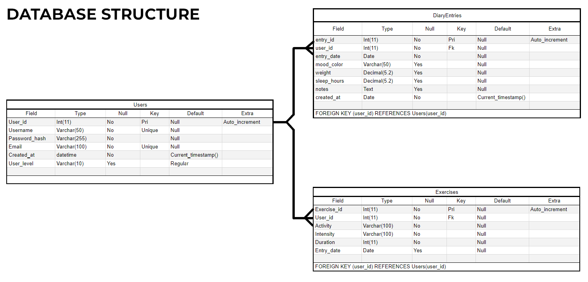
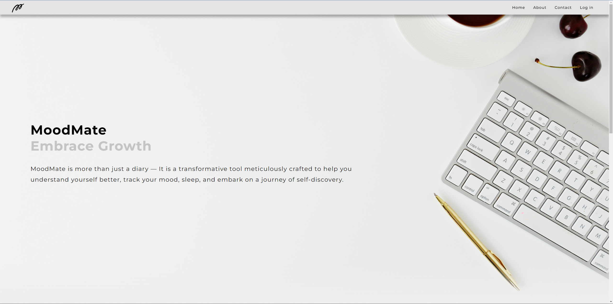
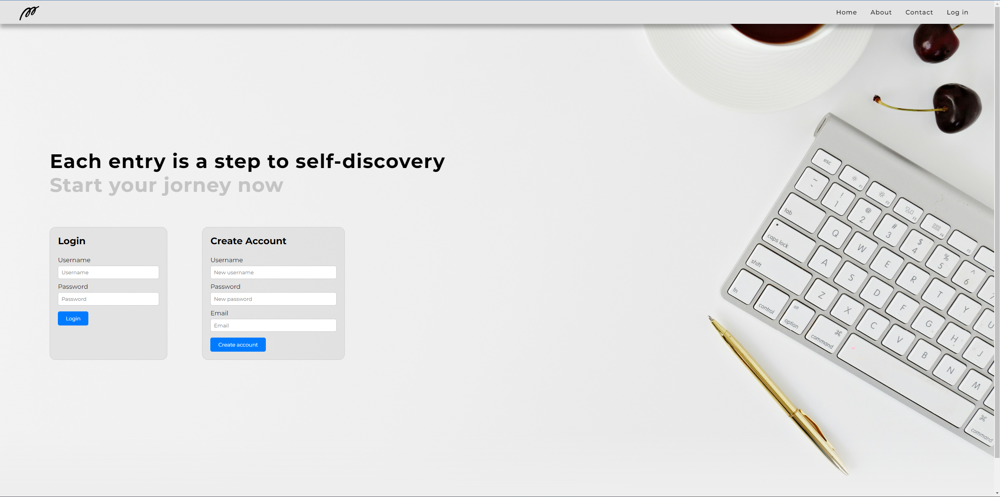
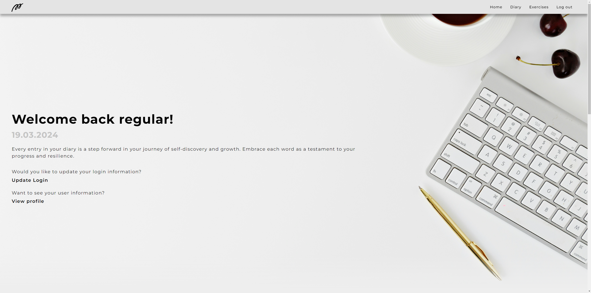
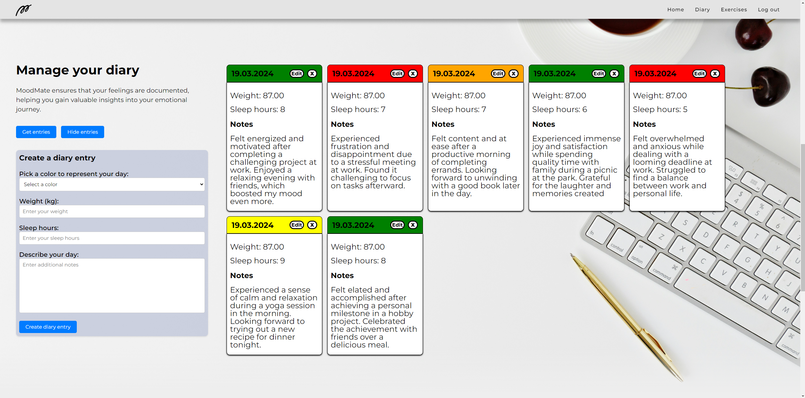
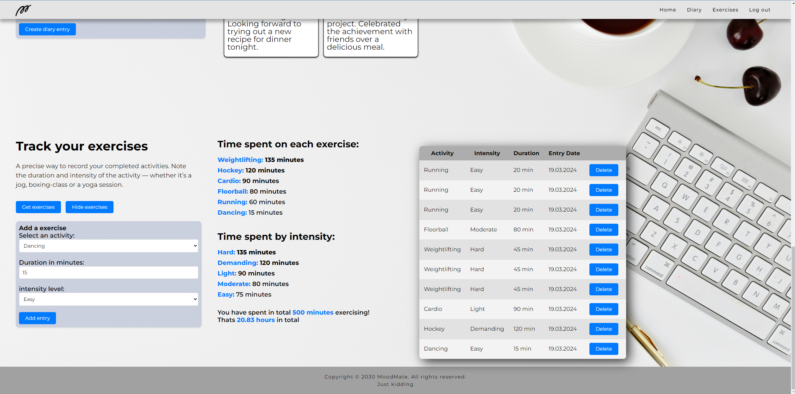
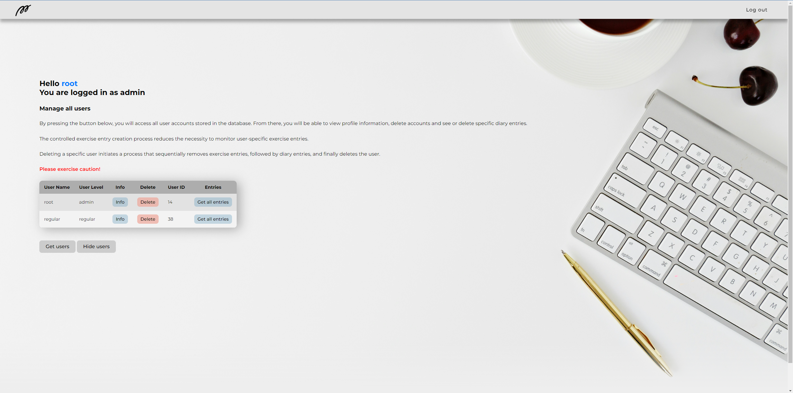

# MoodMate
Welcome to MoodMate - your digital companion for self-discovery and holistic well-being. MoodMate is more than just a diary; it's a transformative tool designed meticulously to help you understand yourself better, track your mood, monitor your sleep, and embark on a journey of personal growth.

This application is a part of a web-development course and it is online during 20.3.2024 - 21.3.2024 or by request\
**Please contact us immediately if you encounter any issues with the server not running when it should be.**

The application can be found in this link: **[MoodMate](https://hyte-server-aleksi.northeurope.cloudapp.azure.com)**

## Backend server and database connection.
The server for this application is based on the example version provided in the web development course, serving as a reference point. Additional functionality has been implemented on top of this base to tailor the server to the specific requirements of the MoodMate application.

Unique features:
- User levels (regular and admin)
- Completely new endpoint (Exercises) and additional functionality
- DiaryEntries table structure has been altered to match the needs of the application
- Some model queries have been altered to match the needs of the application

[Complete API documentation](https://hyte-server-aleksi.northeurope.cloudapp.azure.com/docs/)

MoodMate API features are accessed by URL: `https://hyte-server-aleksi.northeurope.cloudapp.azure.com/api`
```
Endpoints for the API are:
- api/auth/login
- api/auth/me
- api/users
- api/users/:id
- api/entries
- api/entries/:id
- api/exercises
- api/exercises/:id
```

More detailed information about the server can be found in the [MoodMate API repository](https://github.com/Alekkivi/hyte-server-example-24)



## Homepage and its features
The MoodMate homepage welcomes visitors to the application and offers additional insights into the project. It comprises sections such as Home, About, and Contact Us. Users can navigate seamlessly through the page using a smooth scroll navigation bar or opt to log in. Log in will direct the user to a seperate authentication page.



## Authentication page and its features
On this page, users are presented with two separate forms: one for logging in and another for creating an account. This design allows both existing users to access their accounts and new users to register and create their own accounts.



- User can create an account that requires a unique username and email address.
- All new accounts are set to Regular user level by default.
- User can log in to an existing account.
- User input is validated to ensure certain characteristics are met.
- User is provided with hints for incorrect or unavailable inputs.
- User is kept informed about site interactions through a pop-up snackbar.
- User can return to the homepage using the navigation bar.
- Upon successful login, the user's level determines the page to which they are directed.

## Regular user homepage and its features
### Landing 
Because most MoodMate users are regular by user level, this is the most common page. Again the user has a navigation bar that they can use to scroll down smoothly to each section or opt to log out. 

When the page is loaded, the client is verified using local storage to determine if they should have access to the contents of the page. If the client shouldn't have access to the page, they are redirected to the MoodMate homepage. If the verification is successful, the user is greeted by their username.



In the landing section, the user can click on two separate links:
- Both of these links react to user mouse movement by a changing the cursor to pointer and by changing link color on mouse hover.
- One to display a form to update user information such as username, email, or password. Validation is performed on these inputs to ensure they are unique to the MoodMate application.
- One to display a popup modal to display user information in greater detail.

### Diary entries


In the diary section, users can:
- Retrieve all diary entries that the user has made previously. 
- Create new diary entries. Before submission input validation is performed to this new entry. 
- Modify existing diary entries by clicking the 'edit' button on the specific card.
- Delete existing diary entries by clicking the 'deleten button on the specific card. 
- Ability to hide all diary entries from the document flow to maintaining user privacy.
- All actions use a snackbar to provide feedback for successful and unsuccessful interactions.

### Exercise logs


In this section, users can track their performed exercises and activities, including their duration and intensity. By utilizing existing exercise logs, statistics are calculated to analyze how time is distributed between different activities and intensity levels. 

- Users can add exercise logs to record their workouts, including details such as activity type, duration, and intensity.
- They can retrieve all exercise logs to review their training history.
- MoodMate calculates statistics regarding the intensity and duration of different activities.
- Users have the option to delete specific exercise logs.
- All actions use a snackbar to provide feedback for successful and unsuccessful interactions.

## Admin user homepage and its features

Admin users have the capability to manage the application from this dashboard view. However, it's important to note that admin users can only be created by the developer of the MoodMate application.

When the admin page is loaded, the client is verified using local storage to determine if they should have access to the contents of the page. If the client shouldn't have access to the page, they are redirected to the MoodMate homepage. If the verification is successful, the user is greeted by their username.



- Admin user can view all users on the application.
- Admin user can see user-specific diary entries.
- Admin user can delete any diary entry.
- Admin user can access any user's detailed user information.
- Admin user can delete any profile, except their own. This deletion process will also delete every diary and exercise entry associated with that specific user ID.

### Other features
- Basic responsiveness
- A snackbar is used to provide user with feedback
- Users have the ability to log out, which clears the local storage associated with their account.

## Known bugs
- The Modal HTML element might not be supported by every browser, leading to unexpected behavior in certain cases.
- Snackbar might disappear unexpectedly when encountering spam clicking.
- If user updates username and then refreshes the page, the token in local storage is still linked to the previous username and the greetings title will display old username. The new username is synced to the token after signing in for the first time using the new username. This is just a graphical bug and doesnt affect future login. 
- When deleting users as an admin, a 404 error might be logged to the console. This occurs because the application attempts to delete every exercise log and diary entry associated with the user. If the user doesn't have any of these entries, a 404 error occurs. **However, the user is still deleted, but unnecessary errors are logged.**
- There are very rare errors where FK constraints stop user deletion (Fixed 19.3.2024, yet to be tested fully) 

## References
- Lecture materials in Metropolia University of Applied Sciences
- Application is launched on Azure web services
- [Snackbar - w3schools](https://www.w3schools.com/howto/howto_js_snackbar.asp)
- [Background image - unsplash](https://unsplash.com/@fempreneurstyledstock)
- Metropolia UAS logo acts as MoodMate logo
